> $\textcolor{Blue}{参考西湖大学赵世钰老师}$ [github](https://github.com/MathFoundationRL/Book-Mathematical-Foundation-of-Reinforcement-Learning)

# Ch1.基本概念

grid-world example，机器人从 start 走到 target，并且尽量避免 forbidden


### State：agent相对于环境的状态


- state 指 agent 所在的位置

- state place 指所有 state 的集合 $S=\{s_{i}\}_{i=1}^{9}$

### Action：对于每一个 State，可以采取的行动


- 每个状态存在 5 个可能的 actions，即 $a_1,\ a_2,\ a_3,\ a_4,\ a_5$
- action place 指所有 action 的集合 $A(s_i)=\{a_{i}\}_{i=1}^{5}$ ，action 和 state 相互依赖

### State transition：采取 action 时，state 转移的过程

- State transition 表示方式
  - $s_1 \xrightarrow{a_2} s_2$
  - $s_1 \xrightarrow{a_1} s_1$（边界碰壁撞回）
  - $s_5 \xrightarrow{a_2} s_6$（forbidden 允许进入但有惩罚）$s_5 \xrightarrow{a_2} s_5$（forbidden 碰壁撞回）
- State transition probability
  - 确定的状态转移：$p(s_2|s_1,\ a_2)=1$     $p(s_i|s_1,\ a_2)=1,\ \forall i \neq 2$
  - 随机的状态转移：$p(s_2|s_1,\ a_2)=0.5$     $p(s_5|s_1,\ a_2)=0.5$

### Policy：agent 在某个 state 应该采取的 action


### Reward：采取 action 后的奖励

- $r_{bound}=-1 \quad r_{forbid}=-1 \quad r_{target}=+1 \quad r_{otherwise}=0$

- reward 只与当前 state 和 action 相关，与 next state 无关

### Trajectory：state-action-reward 链

<center>
  
  

- 一个 trajectory 的所有 reward 叫做 return，比较 return 可以评估哪个 policy 更好
- $s_1 \xrightarrow[\ r=0\ ]{a_2} s_2 \xrightarrow[\ r=0\ ]{a_3} s_5 \xrightarrow[\ r=0\ ]{a_3} s_8 \xrightarrow[\ r=1\ ]{a_2} s_9$ , $return_1 = 0 + 0 + 0 + 1 = 1$
- $s_1 \xrightarrow[\ r=0\ ]{a_3} s_4 \xrightarrow[\ r=-1\ ]{a_3} s_7 \xrightarrow[\ r=0\ ]{a_2} s_8 \xrightarrow[\ r=+1\ ]{a_2} s_9$ , $return_2 = 0 - 1 + 0 + 1 = 0$

- discount return：引入 discount rate $\gamma \in (0, 1)$ 
  - 对于第一个 trajectory，如果一直停留在 $s_9$ ，return 会无限制增加
  - $discounted\ \ return=0+\gamma0+\gamma^20+\gamma^31+\gamma^41+\gamma^51+...=\gamma^3(1+\gamma+\gamma^2+...)=\gamma^3\frac{1}{1-\gamma}$
  - $\gamma \rightarrow 0$ 更近视，$\gamma \rightarrow 1$ 更远视

### Episode：一个 resulting（到头）的 trajectory

- episode（会结束）可变为 continuing tasks（一直持续）
  - Option 1：将 target 视作特殊的 absorbing state，一旦达到，修改 action space 仅可继续留在 target 中，同时 reward 改为 0
  - Option 2：将 target 视作正常的 normal state，agent 仍可以退出 target 和进入 target，重新进入时 reward 仍为 1

### Markov decision process（MDP）

- 要素1：集合
  - State：$S$
  - Action：$A(s), \  s \in S$
  - Reward：$R(s,\ a)$
- 要素2：概率分布
  - State transition probability：$p(s^{'}|s,\ a)$
  - Reward probability：$p(r|s,\ a)$
- 要素3：决策
  - $\pi(a|s),\ \sum_{a \in A(s)}\pi(a|s)=1$
- **要素4：Markov性质，即无记忆性**
  - $p(s_{t+1}|a_{t+1},s_t,...,a_1,s_0)=p(s_{t+1}|a_{t+1},s_t)$
  - $p(r_{t+1}|a_{t+1},s_t,...,a_1,s_0)=p(r_{t+1}|a_{t+1},s_t)$

---

# Ch2.贝尔曼公式

### State Value

$$
\begin{align*}
S_t \xrightarrow{A_t} &R_{t+1},\, S_{t+1} \xrightarrow{A_{t+1}} R_{t+2},\, S_{t+2} \xrightarrow{A_{t+2}} R_{t+3},\, \cdots \\
\\
v_{\pi}(s)&=\mathbb{E}[G_t|S_t=s]\\
其中\ G_t &= R_{t+1}+\gamma R_{t+2}+\gamma ^2R_{t+3}+ \cdots
\end{align*}
$$

- return 与 state value 的区别
  - return 指单个 trajectory
  - state value 对多个 trajectory 求平均


### Bellman equation

##### 推导

$$
\begin{align*}
v_\pi(s) &= \mathbb{E}[G_t \mid S_t = s] \\
         &= \mathbb{E}[R_{t+1} + \gamma G_{t+1} \mid S_t = s] \\
         &= \color{blue}{\mathbb{E}[R_{t+1} \mid S_t = s]} \color{black}+ \color{red}\gamma {\mathbb{E}[G_{t+1} \mid S_t = s]}
\end{align*}
$$

$$
\color{blue}
\begin{align*}
\mathbb{E}[R_{t+1} \mid S_t = s] &= \sum_a \pi(a|s) \mathbb{E}[R_{t+1} \mid S_t = s, A_t = a] \\
&= \sum_a \pi(a|s) \sum_r p(r|s,a) r
\end{align*}
$$

$$
\color{red}
\begin{align*}
\mathbb{E}[G_{t+1} \mid S_t = s] &= \sum_{s'} \mathbb{E}[G_{t+1} \mid S_t = s, S_{t+1} = s'] p(s'|s) \\
&= \sum_{s'} \mathbb{E}[G_{t+1} \mid S_{t+1} = s'] p(s'|s) \quad 马尔可夫链无记忆性\\
&= \sum_{s'} v_\pi(s') p(s'|s) \\
&= \sum_{s'} v_\pi(s') \sum_a p(s'|s, a) \pi(a|s)
\end{align*}
$$

$$
\begin{align*}
v_\pi(s) &= \color{blue}{\mathbb{E}[R_{t+1} \mid S_t = s]} \color{black}+ \color{red}\gamma {\mathbb{E}[G_{t+1} \mid S_t = s]} \\
&= \sum_a \pi(a|s) \sum_r p(r|s,a) r + \gamma\sum_{s'} v_\pi(s') \sum_a p(s'|s, a) \pi(a|s) \\
&= \color{green}\sum_a \pi(a|s)[\sum_r p(r|s,a) r + \gamma\sum_{s'} p(s'|s, a)\color{black}v_\pi(s')\color{green}]\color{black}, \quad \forall s \in S
\end{align*}
$$

- 求解 $v_{\pi}(s) \quad v_{\pi}(s^{'})$ 使用 bootstrapping
- 求解整个公式也叫做 policy evaluation，因为 policy 即 $\pi(a|s)$ 是给定的
- $p(r|s,a) \quad p(s'|s, a)$ 代表 dynamic model（后续又分 model-based / model-free ）

##### 矩阵表示

$$
\begin{align*}
v_\pi(s_i) &= r_\pi(s_i) + \gamma \sum_{s_j} p_\pi(s_j|s_i) v_\pi(s_j) \\
其中  \quad r_\pi(s) &\triangleq \sum_a \pi(a|s) \sum_r p(r|s,a) r, \quad p_\pi(s'|s) \triangleq \sum_a \pi(a|s) p(s'|s,a)
\end{align*}
$$

$$
\begin{align*}
v_\pi &= r_\pi + \gamma P_\pi v_\pi \\
其中 v_\pi &= [v_\pi(s_1),\, \ldots,\, v_\pi(s_n)]^T \in \mathbb{R}^n \\
r_\pi &= [r_\pi(s_1),\, \ldots,\, r_\pi(s_n)]^T \in \mathbb{R}^n \\
P_\pi &\in \mathbb{R}^{n \times n}, \quad \text{where } [P_\pi]_{ij} = p_\pi(s_j \mid s_i)
\end{align*}
$$

$$
\begin{align*}
\underbrace{
\begin{bmatrix}
v_\pi(s_1) \\
v_\pi(s_2) \\
v_\pi(s_3) \\
v_\pi(s_4)
\end{bmatrix}
}_{v_\pi}
=
\underbrace{
\begin{bmatrix}
r_\pi(s_1) \\
r_\pi(s_2) \\
r_\pi(s_3) \\
r_\pi(s_4)
\end{bmatrix}
}_{r_\pi}
+
\gamma\,
\underbrace{
\begin{bmatrix}
p_\pi(s_1|s_1) & p_\pi(s_2|s_1) & p_\pi(s_3|s_1) & p_\pi(s_4|s_1) \\
p_\pi(s_1|s_2) & p_\pi(s_2|s_2) & p_\pi(s_3|s_2) & p_\pi(s_4|s_2) \\
p_\pi(s_1|s_3) & p_\pi(s_2|s_3) & p_\pi(s_3|s_3) & p_\pi(s_4|s_3) \\
p_\pi(s_1|s_4) & p_\pi(s_2|s_4) & p_\pi(s_3|s_4) & p_\pi(s_4|s_4)
\end{bmatrix}
}_{P_\pi}
\underbrace{
\begin{bmatrix}
v_\pi(s_1) \\
v_\pi(s_2) \\
v_\pi(s_3) \\
v_\pi(s_4)
\end{bmatrix}
}_{v_\pi}
\end{align*}
$$

##### 求解 state value（评价 policy ）

<a name="solve state value"></a>
$$
\begin{align*}
v_\pi &= r_\pi + \gamma P_\pi v_\pi \\
closed-form\ \ solution \quad v_\pi &= (I - \gamma P_\pi)^{-1} r_\pi \\
iterative\ \ solution\ (preferred) \quad v_{k+1} &= r_\pi + \gamma P_\pi v_k \quad v_k \rightarrow v_\pi = (I-\gamma P_\pi)^{-1}r_\pi,\ k \rightarrow \infty
\end{align*}
$$


```python
import numpy as np

def build_gridworld(gamma=0.9, n=5, forbid=None, target=None, arrow_map=None):
    """
    r_doundary = r_forbidden = -1
    r_target = +1
    r_otherwise = 0
    gamma = 0.9
    """
    n_states = n * n
    reward = np.zeros(n_states)
    P = np.zeros((n_states, n_states))

    if forbid is None:
        forbid = []
    if target is None:
        target = 0

    for i in range(n):
        for j in range(n):
            s = i * n + j
            # target state
            if s == target:
                P[s, s] = 1
                reward[s] = 1
                continue
            action = arrow_map[i][j]
            ni, nj = i + action[0], j + action[1]
            if 0 <= ni < n and 0 <= nj < n:
                s2 = ni * n + nj
                P[s, s2] = 1
                # forbidden state
                if s2 in forbid:
                    reward[s] = -1
                # target state
                elif s2 == target:
                    reward[s] = 1
            # boundary state
            else:
                P[s, s] = 1
                reward[s] = -1
    return P, reward

def value_iteration(P, reward, gamma=0.9, n_iter=100):
    v = np.zeros_like(reward)
    # 迭代法, 初始全设置为0即可, slides ch2 P40有数学证明
    for _ in range(n_iter):
        v = reward + gamma * P @ v
    return v

def value_closed_form(P, reward, gamma=0.9):
    n_states = len(reward)
    I = np.eye(n_states)
    v = np.linalg.solve(I - gamma * P, reward)
    return v

def main():
    gamma = 0.9
    n = 5
    forbid = [6, 7, 12, 16, 18, 21]
    target = 17
    """
    actions = {
        (0, 1): 1,     # right
        (0, -1): -1,   # left
        (1, 0): 5,     # down
        (-1, 0): -5    # up
    }
    """
    arrow_map = [
        [(0, 1), (0, 1), (0, 1), (1, 0), (1, 0)],
        [(-1, 0), (-1, 0), (0, 1), (1, 0), (1, 0)],
        [(-1, 0), (0, -1), (1, 0), (0, 1), (1, 0)],
        [(-1, 0), (0, 1), (0, 0), (0, -1), (1, 0)],
        [(-1, 0), (0, 1), (-1, 0), (0, -1), (0, -1)]
    ]
    P, reward = build_gridworld(gamma, n, forbid, target, arrow_map)

    # 迭代法
    v_iter = value_iteration(P, reward, gamma)
    print("值迭代法结果:")
    print(np.round(v_iter.reshape(n, n), 2))

    # 闭式解法
    v_closed = value_closed_form(P, reward, gamma)
    print("\n矩阵公式法结果:")
    print(np.round(v_closed.reshape(n, n), 2))

if __name__ == "__main__":
    main()
    
"""
值迭代法结果:
[[ 3.49  3.87  4.3   4.78  5.31]
 [ 3.14  3.49  4.78  5.31  5.9 ]
 [ 2.82  2.54 10.    5.9   6.56]
 [ 2.54 10.   10.   10.    7.29]
 [ 2.29  9.   10.    9.    8.1 ]]

矩阵公式法结果:
[[ 3.49  3.87  4.3   4.78  5.31]
 [ 3.14  3.49  4.78  5.31  5.9 ]
 [ 2.82  2.54 10.    5.9   6.56]
 [ 2.54 10.   10.   10.    7.29]
 [ 2.29  9.   10.    9.    8.1 ]]
"""
```

### Action Value

$$
\begin{align*}
q_\pi(s, a) = \mathbb{E}[G_t \mid S_t = s,\, A_t = a]
\end{align*}
$$

$$
\begin{align*}
\underbrace{\mathbb{E}[G_t \mid S_t = s]}_{v_\pi(s)}
= \sum_a
\underbrace{\mathbb{E}[G_t \mid S_t = s,\, A_t = a]}_{q_\pi(s, a)}
\, \pi(a|s)
\end{align*}
$$

$$
\begin{align*}
\color{blue}v_\pi(s) &\color{blue}= \sum_{a}\pi(a|s)q_\pi(s, a) \\
&= \sum_{a}\pi(a|s)[\sum_r p(r|s,a) r + \gamma\sum_{s'} p(s'|s, a)v_\pi(s')] \\
s.t.\quad \color{blue}q_\pi(s, a) &\color{blue}= \sum_r p(r|s,a) r + \gamma\sum_{s'} p(s'|s, a)v_\pi(s')
\end{align*}
$$

---

# Ch3.贝尔曼最优公式

### Optimal policy

如果对于所有的 $s$ 和其他策略 $\pi$，都有 $v_{\pi^{*}} \geq v_{\pi}(s)$，则策略 $\pi^{*}$ 是最优的

### Bellman optimality equation（BOE）

##### 表示方式

- elementwise form

$$
\begin{align*}
v(s) &= \max\limits_{\pi} \sum_{a}\pi(a|s)[\sum_r p(r|s,a) r + \gamma\sum_{s'} p(s'|s, a)v(s')] \quad \forall s \in S \\
&= \max\limits_{\pi}\sum_{a}\pi(a|s)q(s, a) \quad \forall s \in S \\
\end{align*}
$$

- matrix-vector form

$$
\begin{align*}
v = \max\limits_{\pi}(r_\pi + \gamma P_{\pi}v)
\end{align*}
$$

##### 求解（值迭代）

- 先求解最优策略（固定 $v$ 求 $\pi$ ）

因为 $\sum_{a}\pi(a|s)=1$，所以 $v$ 的最大值就是取最大的 $q(s,a)$，然后令 $\pi(s,a)=1$ 即可
$$
\begin{align*}
v &= \max\limits_{\pi}\sum_{a}\pi(a|s)q(s, a) \\
&= \max\limits_{a \in A(s)}q(s,a)
\end{align*}
$$

$$
\begin{align*}
\pi(a|s) =
\begin{cases}
1 & a = a^*, \quad 其中 a^* = \arg\max_a q(s, a) \\
0 & a \neq a^*
\end{cases}
\end{align*}
$$

- 再求解最优价值（已知最优策略 $\pi$ 和 $P_\pi$ ）


$v = f(v) = \max\limits_{\pi}(r_\pi + \gamma P_\pi v)$ 是一个 **contraction mapping**，存在最优解且唯一，因此迭代求解最终便可收敛
$$
\begin{align*}
v_{k+1} = f(v_k) = \max\limits_{\pi}(r_\pi + \gamma P_\pi v_k) \\
给定初始值 v_0,\ \{v_k\} 最终收敛至 v^*
\end{align*}
$$

##### 性质

- 实质：贝尔曼最优是策略取 $\pi^*$ 时的一种特殊贝尔曼
- 存在性：最优 $v$ 一定存在

- 唯一性：最优 $v$ 一定唯一，$\pi^{*}$ 不一定
- 相对性：$r \rightarrow ar+b$，得到的最优策略是一样的
- 无意义 detour：如果两个普通区域的移动 reward 为 0，理论上讲从其中一个区域直接到 target 和从这个普通区域绕一大圈再进 target 这两种策略是一样，但因为 $\gamma$ 的存在，最优策略不会是无意义的 detour

# Ch4.值迭代和策略迭代

### Value iteration

给定初始价值 $v_k$

- Step 1：policy update（给定 $v_k$ ）

$$
\begin{align*}
矩阵表示 \quad \pi_{k+1} = \arg\max\limits_{\pi} (r_\pi + \gamma P_\pi v_k) \\
求解使用\ element-wise\ form
\end{align*}
$$

因为已知 $v_k$，可以穷举每个 $s$ 的策略 $A(s)$ 求得 $\max\ q_k(a, s)$，$\pi_{k+1}$ 是一种贪婪策略

<a name="value evalution step 1"></a>
$$
\begin{align*}
\pi_{k+1}(s) &= \arg\max\limits_{\pi} \sum_{a}\pi(a|s)\underbrace{[\sum_r p(r|s,a) r + \gamma\sum_{s'} p(s'|s, a)v(s')]}_{q_k(s,a)}, \quad \forall s \in S
\end{align*}
$$

$$
\begin{align*}
\pi_{k+1}(a|s) =
\begin{cases}
1 & a = a^*, \quad 其中 a^* = \arg\max_a q_{k}(s, a) \\
0 & a \neq a^*
\end{cases}
\end{align*}
$$

- Step 2：value update（给定 $P_{\pi \ k+1}$ ）

$$
\begin{align*}
矩阵表示 \quad v_{k+1} = r_{\pi \ k+1} + \gamma P_{\pi \ k+1} v_k \\
求解使用\ element-wise\ form
\end{align*}
$$

因为已知 $\pi_{k+1}$，所以 $v_{k+1}(s)$ 即是最大的 $q_k(s,a)$
$$
\begin{align*}
v_{k+1}(s) &= \sum_{a}\pi_{k+1}(a|s)\underbrace{[\sum_r p(r|s,a) r + \gamma\sum_{s'} p(s'|s, a)v(s')]}_{q_k(s,a)}, \quad \forall s \in S \\
&= \max\limits_{a} q_k(s,a)
\end{align*}
$$


```python
import numpy as np


def calculate_q(n, s, a, v, r, action_choice, gamma, forbidden, target):
    """
    计算 q 值
    """
    now_i, now_j = s // n, s % n
    offset = action_choice[a]
    next_i, next_j = now_i + offset[0], now_j + offset[1]

    # 检查是否越界
    if next_i < 0 or next_i >= n or next_j < 0 or next_j >= n:
        return r['boundary'] + gamma * v[s]

    next_s = next_i * n + next_j
    if next_s in forbidden:
        return r['forbidden'] + gamma * v[next_s]
    if next_s == target:
        return r['target'] + gamma * v[next_s]

    return r['otherwise'] + gamma * v[next_s]


def value_iteration(n, v, pi, reward, action_choice, forbidden, target, gamma=0.9, n_iter=10000, epsilon=1e-6):
    iteration = 0
    v_old = np.ones_like(v)

    while iteration < n_iter and np.max(np.abs(v - v_old)) > epsilon:
        v_old = v.copy()
        # for each state
        for s in range(n**2):
            # for each action
            q_final, a_final = -np.inf, -1
            for a in range(5):
                q = calculate_q(n, s, a, v, reward, action_choice, gamma, forbidden, target)
                if q > q_final:
                    q_final = q
                    a_final = a
            # policy update
            pi[s] = a_final
            # value update
            v[s] = q_final
        iteration += 1
            
    return v, pi, iteration


def print_policy(pi, n, action_str):
    res = np.zeros((n, n), dtype=str)
    for i in range(n):
        for j in range(n):
            s = i * n + j
            action = pi[s]
            res[i, j] = action_str[action]
    return res


def print_state_value(v, n):
    res = np.zeros((n, n), dtype=float)
    for i in range(n):
        for j in range(n):
            s = i * n + j
            res[i, j] = v[s]
    return res


def main():
    reward = {
        'boundary': -1,
        'target': 1,
        'forbidden': -1,
        'otherwise': 0
    }
    action_choice = {
        0: (0, 1),   # right
        1: (-1, 0),   # up
        2: (0, -1),  # left
        3: (1, 0),  # down
        4: (0, 0)    # stay
    }
    action_str = {
        0: '→',   # right
        1: '↑',   # up
        2: '←',   # left
        3: '↓',   # down
        4: '◦'  # stay
    }
    gamma = 0.9

    # n = 2
    # forbidden = [1]
    # target = 3
    # n_states = n * n

    n = 5
    forbidden = [6, 7, 12, 16, 18, 21]
    target = 17
    n_states = n * n

    v = np.zeros(n_states)
    pi = np.zeros(n_states, dtype=int)
    v, pi, iteration = value_iteration(n, v, pi, reward, action_choice, forbidden, target, gamma=gamma)
    print(f"Value Iteration completed in {iteration} iterations.")
    print("Optimal Policy:")
    print(print_policy(pi, n, action_str))
    print("State Values:")
    print(print_state_value(v, n))


if __name__ == "__main__":
    main()
```

### Policy iteration

给定随机初始策略 $\pi_k$

- Step 1：policy evaluation（PE）

已知 $\pi_k$ 求解 $v_{\pi k}$，具体求解参考 [iterative solution](#solve state value)
$$
\begin{align*}
v_{\pi k} &= r_{\pi k} + \gamma P_{\pi} v_{\pi k}
\end{align*}
$$
越靠近 target 的区域 value 变好的越快，近水楼台先得月，因为 $v$ 的更新严重依赖 $\pi$ 的好坏

- Step 2：policy improvement（PI）

最优化求解更新策略 $\pi_{k+1}$，具体求解参考 [value evaluation step 1](#value evalution step 1)
$$
\begin{align*}
\pi_{k+1} = \arg\max\limits_{\pi}(r_\pi + \gamma P_\pi v_{\pi k})
\end{align*}
$$
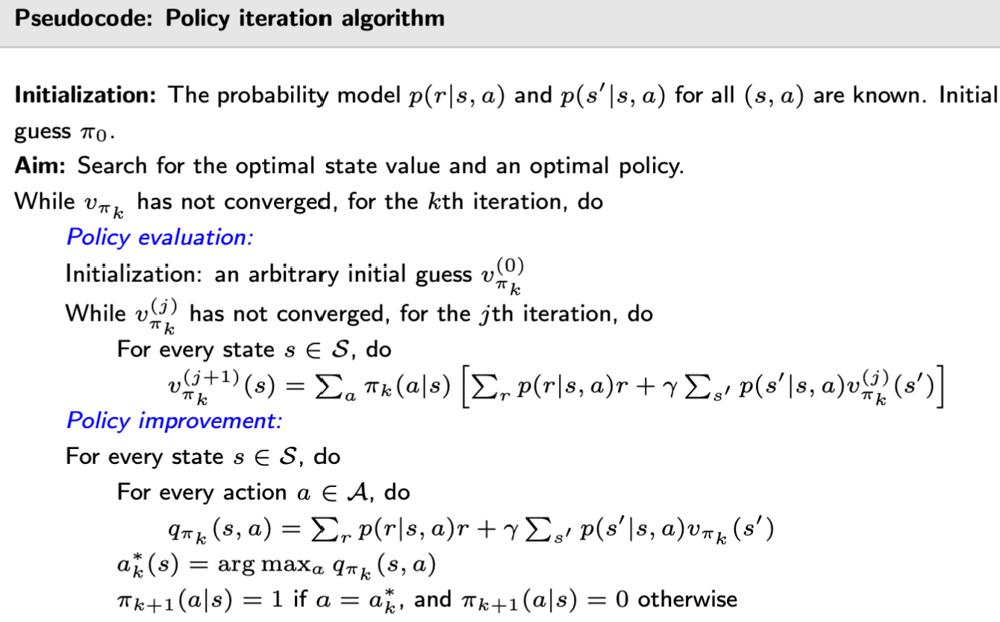

```python
import numpy as np


def calculate_q(n, s, a, v, r, action_choice, gamma, forbidden, target):
    """
    计算 q 值
    """
    now_i, now_j = s // n, s % n
    offset = action_choice[a]
    next_i, next_j = now_i + offset[0], now_j + offset[1]

    # 检查是否越界
    if next_i < 0 or next_i >= n or next_j < 0 or next_j >= n:
        return r['boundary'] + gamma * v[s]

    next_s = next_i * n + next_j
    if next_s in forbidden:
        return r['forbidden'] + gamma * v[next_s]
    if next_s == target:
        return r['target'] + gamma * v[next_s]

    return r['otherwise'] + gamma * v[next_s]


def pi_to_P_r(n, pi, action_choice, reward, forbidden, target):
    """
    将策略转换为转移概率矩阵
    """
    n_states = n * n
    P = np.zeros((n_states, n_states))
    r = np.zeros(n_states)

    for s in range(n_states):
        action = pi[s]
        offset = action_choice[action]
        next_i, next_j = s // n + offset[0], s % n + offset[1]

        if 0 <= next_i < n and 0 <= next_j < n:
            next_s = next_i * n + next_j
            P[s, next_s] = 1.0
            if next_s in forbidden:
                r[s] = reward['forbidden']
            elif next_s == target:
                r[s] = reward['target']
            else:
                r[s] = reward['otherwise']
        else:
            P[s, s] = 1.0
            r[s] = reward['boundary']

    return P, r


def iteration_solution(P, r, gamma=0.9, n_iter=100, epsilon=1e-3):
    v = np.zeros_like(r)
    v_old = np.ones_like(v)
    iteration = 0
    while iteration < n_iter and np.max(np.abs(v - v_old)) > epsilon:
        v_old = v.copy()
        v = r + gamma * P @ v
        iteration += 1
    return v, iteration


def policy_iteration(n, v, pi, reward, action_choice, forbidden, target, gamma=0.9, n_iter=10000, epsilon=1e-6):
    iteration, inner_iteration = 0, 0
    n_states = n * n
    v_old = np.ones_like(v)

    while iteration < n_iter and np.max(np.abs(v - v_old)) > epsilon:
        v_old = v.copy()

        # policy evaluation
        P, r = pi_to_P_r(n, pi, action_choice, reward, forbidden, target)
        v, ii = iteration_solution(P, r, gamma=gamma, n_iter=100)
        inner_iteration += ii

        # policy improvement
        for s in range(n_states):
            q_final, a_final = -np.inf, -1
            for a in range(len(action_choice)):
                q = calculate_q(n, s, a, v, reward, action_choice, gamma, forbidden, target)
                if q > q_final:
                    q_final = q
                    a_final = a
            pi[s] = a_final

        iteration += 1
            
    return v, pi, iteration, inner_iteration


def print_policy(pi, n, action_str):
    res = np.zeros((n, n), dtype=str)
    for i in range(n):
        for j in range(n):
            s = i * n + j
            action = pi[s]
            res[i, j] = action_str[action]
    return res


def print_state_value(v, n):
    res = np.zeros((n, n), dtype=float)
    for i in range(n):
        for j in range(n):
            s = i * n + j
            res[i, j] = v[s]
    return res


def main():
    reward = {
        'boundary': -1,
        'target': 1,
        'forbidden': -1,
        'otherwise': 0
    }
    action_choice = {
        0: (0, 1),   # right
        1: (-1, 0),   # up
        2: (0, -1),  # left
        3: (1, 0),  # down
        4: (0, 0)    # stay
    }
    action_str = {
        0: '→',   # right
        1: '↑',   # up
        2: '←',   # left
        3: '↓',   # down
        4: '◦'  # stay
    }
    gamma = 0.9

    # n = 2
    # forbidden = [1]
    # target = 3
    # n_states = n * n

    n = 5
    forbidden = [6, 7, 12, 16, 18, 21]
    target = 17
    n_states = n * n

    v = np.zeros(n_states)
    pi = np.zeros(n_states, dtype=int)
    v, pi, iteration, inner_iteration = policy_iteration(n, v, pi, reward, action_choice, forbidden, target, gamma=gamma)
    print(f"Policy Iteration completed in {iteration} outer_iterations and {inner_iteration} inner_iteration.")
    print("Optimal Policy:")
    print(print_policy(pi, n, action_str))
    print("State Values:")
    print(print_state_value(v, n))


if __name__ == "__main__":
    main()
```

### Truncated Policy iteration

- $\textcolor{red}{value\ iteration\quad 和\quad policy\ iteration\quad 的步骤基本相反}$
- $\textcolor{red}{可以把\quad value\ iteration\quad 的\quad value\ update\quad 看作一次效果不是很好的\quad policy\ evaluation}$
- $\color{red}v_{\pi 1} \geq u_1$


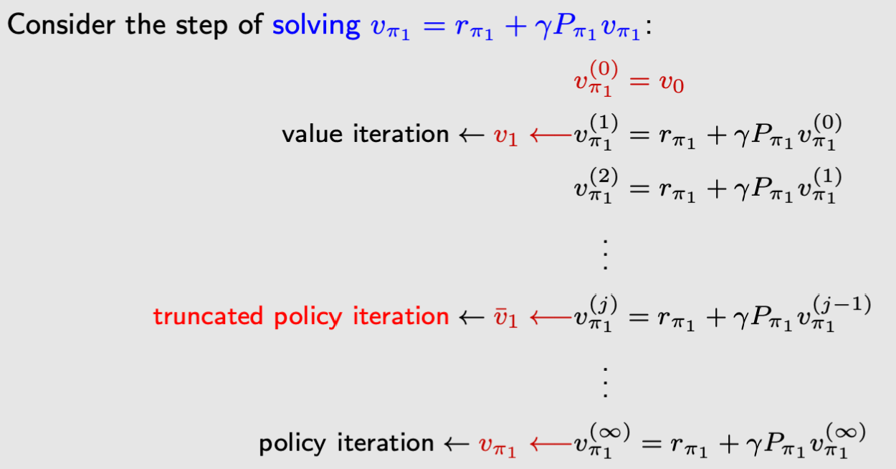

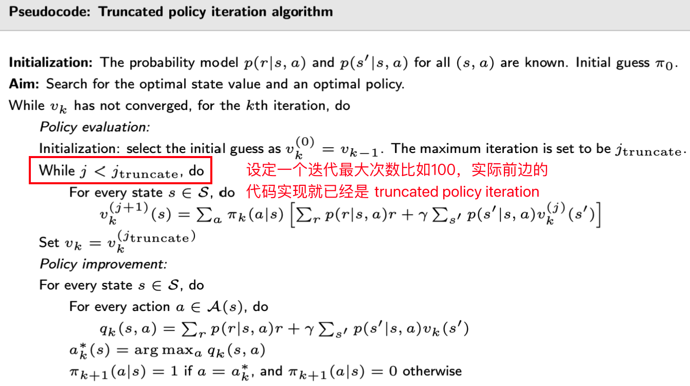

---

# Ch5.Monte Carlo Learning

### MC Basic

**核心：把 policy iteration 的 model-based 转为 model-free。而 model-based 的核心在于求 $q_{\pi k}(s,a)$**（$\color{red}{数据和模型必有其一}$）
$$
\begin{align*}
q_{\pi_k}(s, a) &= \sum_r p(r|s,a) r + \gamma \sum_{s'} p(s'|s,a) v_{\pi_k}(s') \\
\downarrow \\
q_{\pi_k}(s, a) &= E[G_t|S_t=s,\ A_t=a]\approx\frac{1}{N} \sum_{i=1}^{N} g^{(i)}(s, a)
\end{align*}
$$
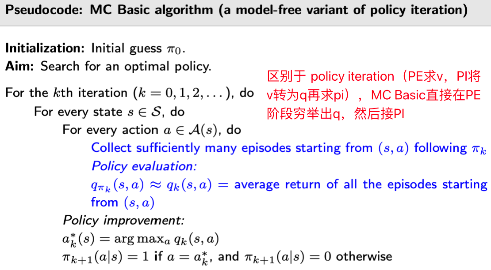

### MC Exploring Starts

- first-visit and every-visit

  - first-visit：对于初始 $(s_0,a_0)$，仅使用此 episode 的 $q(s_0,a_0)$ 估计它
  - every-visit：对于初始 $(s_0,a_0)$，使用零时刻的 $q_{t_0}(s_0,a_0)$ 估计它，且如果 $(s_0,a_0)$ 重新出现在此 episode 之后的某个位置，也可以使用 $q_{t_n}(s_0,a_0)$ 估计它

- MC basic and MC Exploring Starts

  - MC basic：针对每一个 $(s,a)$ 求 $q(s,a)$，相当于要把 $(s,a)$ 对应的所有 episodes 全部穷举

  - MC Exploring Starts：从每个 $(s,a)$ 出发生成一些 episodes，并尽量确保所有的 $(s,a)$ 都包含在其中。对每一条 episode，从后向前依次更新包含 $(s_t,a_t)$ 的 $r(s_t,a_t)$ 和 $q(s_t,a_t)$，并以 $a=\arg\max\limits_{a} q(s_t,a)$ 更新当前 $s_t$ 的策略 $\pi_(a|s_t)=1$

（下图代码属于 every-visit ）

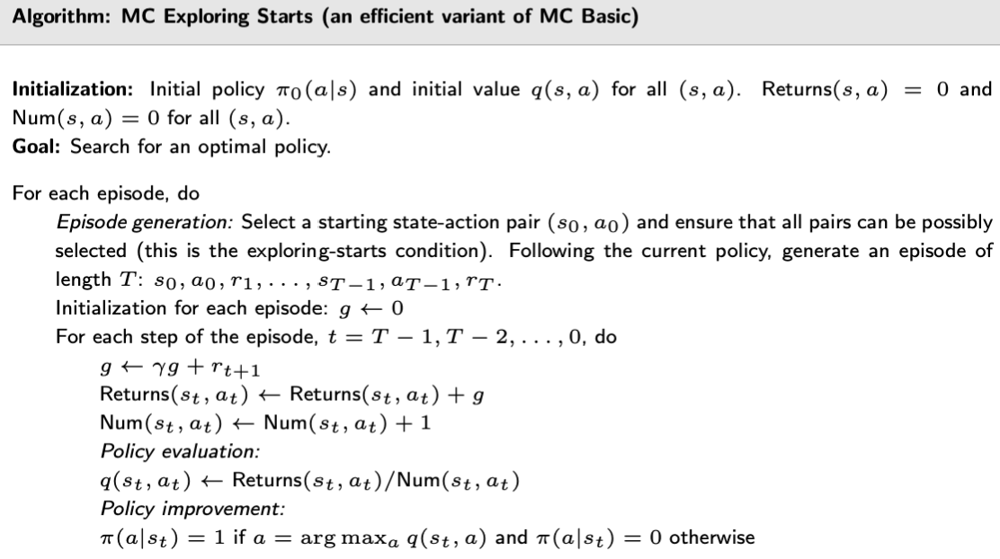

### MC $\epsilon$-Greedy

- $\epsilon \rightarrow 1$：exploration，更探索，其他策略概率更高，更大概率需更少的 episodes 即包含所有的 $(s,a)$
- $\epsilon \rightarrow 0$：expliotation，更剥削利用，$q(s,a)$ 更大的策略概率高，$=0$ 退化为 greedy

$$
\begin{align*}
\pi_{k+1}(s) &= 
\mathop{\arg\max}\limits_{\pi \in \Pi_\varepsilon}
\sum_a \pi(a|s) q_{\pi_k}(s, a) \\

\pi_{k+1}(a|s) &= 
\begin{cases}
1 - \frac{|\mathcal{A}(s)|-1}{|\mathcal{A}(s)|} \varepsilon, & a = a^*_k, \\
\frac{1}{|\mathcal{A}(s)|} \varepsilon, & a \neq a^*_k.
\end{cases}

\end{align*}
$$

（下图代码属于 every-visit ）

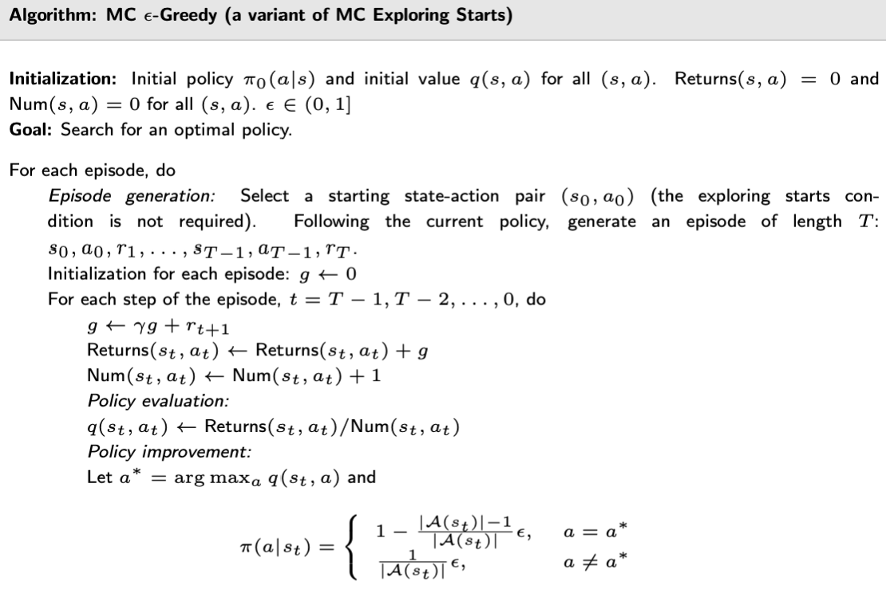

---

# CH6.随机近似和随机梯度下降

### Mean estimation

随机近似算法每次求 $E(x)$，都要用到之前的所有 $x$，为简化效率，引入 $w_k$
$$
\begin{align*}
w_{k+1} &= \frac{1}{k} \sum_{i=1}^{k} x_i \qquad k = 1, 2, \ldots \\
w_{k+1} &= w_k - \frac{1}{k} (w_k - x_k)
\end{align*}
$$

### Robbin-Monro algorithm（RM）

目标：求解 $g(w) = 0$，但不知道 $g(w)$ 的形式，只能根据 $w$ 拿到输出 $g(w)$，假设最优解为 $w^*$
$$
\begin{align*}
w_{k+1} = w_k - a_k \tilde{g}(w_k, \eta_k), \qquad k = 1, 2, 3, \ldots
\end{align*}
$$

- $w_k$ 是第 $k$ 次估计
- $\tilde{g}(w_k, \eta_k)=g(w_k)+\eta_k$ 是第 $k$ 次观测，$\eta_k$ 是白噪声
- $a_k$ 是正系数，一般取 $a_k = 1/k$，但实际可能会选一个很小的正数，保证迭代次数很大时的新数据也有作用
- 没有模型，仅依赖数据


### Stochastic gradient descent algorithm（SGD）

优化问题如下，优化参数 $w$ 以求 $J$ 的最小值
$$
\begin{align*}
\min_{w} \; J(w) = \mathbb{E}[f(w, X)]
\end{align*}
$$

- 方法1：GD，缺点是需要计算 $X$ 的期望

$$
\begin{align*}
w_{k+1} = w_k - \alpha_k \nabla_w \mathbb{E}[f(w_k, X)] = w_k - \alpha_k \mathbb{E}[\nabla_w f(w_k, X)]
\end{align*}
$$

- 方法2：BGD，缺点是每次迭代需要很多样本计算 $\frac{1}{n} \sum_{i=1}^{n} \nabla_w f(w_k, x_i)$

$$
\begin{align*}
\mathbb{E}[\nabla_w f(w_k, X)] \approx \frac{1}{n} \sum_{i=1}^{n} \nabla_w f(w_k, x_i) \\
w_{k+1} = w_k - \alpha_k \frac{1}{n} \sum_{i=1}^{n} \nabla_w f(w_k, x_i)
\end{align*}
$$

- 方法3：SGD，每次迭代仅需随机一个值更新（不排序，随机抽取即可）
  - $w_k$ 远离 $w^*$ 时，SGD 与 GD 别无二异
  - $w_k$ 接近 $w^*$ 时，SGD 在更新 $w_k$ 时会在 $w^*$ 附近横跳，是一个比较好的性质

$$
\begin{align*}
w_{k+1} = w_k - \alpha_k \nabla_w f(w_k, x_k)
\end{align*}
$$


- MBGD
  - $m=1$，MBGD = SGD
  - $m = n$，MBGD 和 BGD 严格意义不相同，因为 MBGD 是在 $n$ 个样本有放回抽样 $m$ 次，可能重复

---

# Ch7.Temporal-difference learning

### TD learning of state value

$(s_0, r_1, s_1, \dots, s_t, r_{t+1}, s_{t+1}, \dots)$ 是由策略 $\pi$ 生成的，目标是估计 $\{v_\pi(s)_{s \in S}\}$​，TD learning 算法如下
$$
\begin{align*}
v_{t+1}(s_t) &= v_t(s_t) - \alpha_t(s_t)\left[v_t(s_t) - \left[r_{t+1} + \gamma v_t(s_{t+1})\right]\right] \\
v_{t+1}(s) &= v_t(s), \quad \forall s \neq s_t \\

\underbrace{v_{t+1}(s_t)}_{\text{new estimate}} &= \underbrace{v_t(s_t)}_{\text{current estimate}} - \alpha_t(s_t)\underbrace{\left[v_t(s_t) - \underbrace{\left[r_{t+1} + \gamma v_t(s_{t+1})\right]}_{\text{TD target } \tilde{v}_t}\right]}_{\text{TD error } \delta_t}
\end{align*}
$$
算法实际上是让 $v(s_t)$ 朝着 $\overline{v_t} = [r_{t+1} + \gamma v_t(s_{t+1})]$ 渐进
$$
\begin{align*}
& v_{t+1}(s_t) = v_t(s_t) - \alpha_t(s_t)[v_t(s_t) - \bar{v}_t] \\
\Longrightarrow \quad & v_{t+1}(s_t) - \bar{v}_t = v_t(s_t) - \bar{v}_t - \alpha_t(s_t)[v_t(s_t) - \bar{v}_t] \\
\Longrightarrow \quad & v_{t+1}(s_t) - \bar{v}_t = [1 - \alpha_t(s_t)][v_t(s_t) - \bar{v}_t] \\
\Longrightarrow \quad & |v_{t+1}(s_t) - \bar{v}_t| = |1 - \alpha_t(s_t)||v_t(s_t) - \bar{v}_t| \\

& 0 < 1 - \alpha_t(s_t) < 1 \\

& |v_{t+1}(s_t) - \bar{v}_t| \leq |v_t(s_t) - \bar{v}_t|
\end{align*}
$$
TD 算法只能用来估计给定策略的 state value，不能估计 action value，也不能找到最优策略


### Sarsa（求解贝尔曼方程）

$\{(s_t, a_t, r_{t+1}, s_{t+1}, a_{t+1})\}_t$，目标是估计 $\{q_\pi(s,a)_{s \in S}\}$，Sarsa 算法如下
$$
\begin{align*}
q_{t+1}(s_t, a_t) &= q_t(s_t, a_t) - \alpha_t(s_t, a_t)\left[q_t(s_t, a_t) - \left[r_{t+1} + \gamma q_t(s_{t+1}, a_{t+1})\right]\right] \\
q_{t+1}(s, a) &= q_t(s, a), \quad \forall(s, a) \neq (s_t, a_t)
\end{align*}
$$
以上仅是估计 action value，即 policy evaluation，结合 policy improvement 代码如下

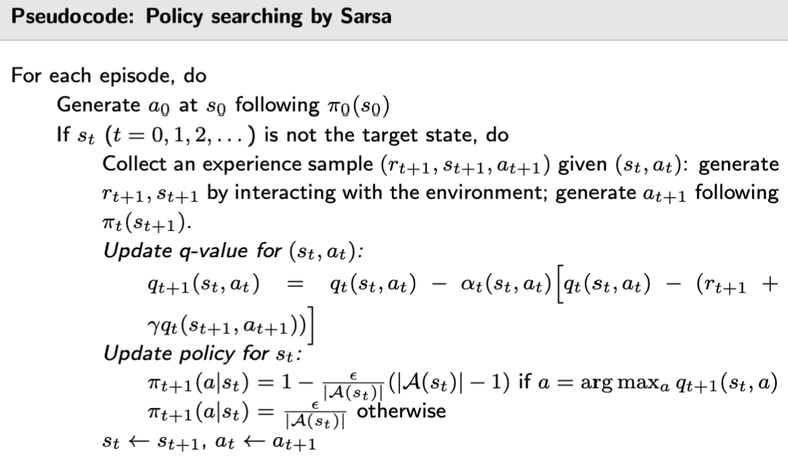

### n-step Sarsa

$$
\begin{align*}
q_\pi(s, a) &= \mathbb{E}[G_t | S_t = s, A_t = a] \\
\text{Sarsa} \leftarrow \quad &G_t^{(1)} = R_{t+1} + \gamma q_\pi(S_{t+1}, A_{t+1}), \\
&G_t^{(2)} = R_{t+1} + \gamma R_{t+2} + \gamma^2 q_\pi(S_{t+2}, A_{t+2}), \\
&\quad\vdots \\
\text{n-step Sarsa} \leftarrow \quad &G_t^{(n)} = R_{t+1} + \gamma R_{t+2} + \cdots + \gamma^n q_\pi(S_{t+n}, A_{t+n}) \\
&\quad\vdots \\
\text{MC} \leftarrow \quad &G_t^{(\infty)} = R_{t+1} + \gamma R_{t+2} + \gamma^2 R_{t+3} + \cdots
\end{align*}
$$

$$
\begin{align*}
Sarsa \quad q_\pi(s, a) &= \mathbb{E}[G_t^{(1)} | s, a] = \mathbb{E}[R_{t+1} + \gamma q_\pi(S_{t+1}, A_{t+1}) | s, a]. \\
MC \quad q_\pi(s, a) &= \mathbb{E}[G_t^{(\infty)} | s, a] = \mathbb{E}[R_{t+1} + \gamma R_{t+2} + \gamma^2 R_{t+3} + \cdots | s, a]. \\
n-step\ Sarsa \quad q_\pi(s, a) &= \mathbb{E}[G_t^{(n)} | s, a] = \mathbb{E}[R_{t+1} + \gamma R_{t+2} + \cdots + \gamma^n q_\pi(S_{t+n}, A_{t+n}) | s, a]
\end{align*}
$$

$\{(s_t, a_t, r_{t+1}, s_{t+1}, a_{t+1}, \dots, r_{t+n}, s_{t+n}, a_{t+n})\}_t$，目标是估计 $\{q_\pi(s,a)_{s \in S}\}$，n-step Sarsa 算法如下（实际到了 $t+n$ 得到数据才能更新 $t$ 时刻的 $q_{t+1}(s_t,a_t)$ ）
$$
\begin{align*}
q_{t+1}(s_t, a_t) &= q_t(s_t, a_t) - \alpha_t(s_t, a_t)\left[q_t(s_t, a_t) - \left[r_{t+1} + r_{t+2} + \dots + \gamma^{n} q_t(s_{t+n}, a_{t+n})\right]\right]
\end{align*}
$$

### Q-learning（求解贝尔曼最优方程）

$\{(s_t, a_t, r_{t+1}, s_{t+1})\}_t$
$$
\begin{align*}
q_{t+1}(s_t, a_t) &= q_t(s_t, a_t) - \alpha_t(s_t, a_t)\left[q_t(s_t, a_t) - \left[r_{t+1} + \gamma \max_{a \in A} q_t(s_{t+1}, a)\right]\right] \\
q_{t+1}(s, a) &= q_t(s, a), \quad \forall(s, a) \neq (s_t, a_t)
\end{align*}
$$

- behavior policy：用来生成 experience samples 的策略
- target policy：更新最优策略
  - on—policy：behavior = target
    - Sarsa：用 $\pi_t$ 生成 experiences，计算 $q_{\pi_{t}}(s_t, a_t)$，反过来更新 $\pi_t \rightarrow \pi_{t+1}$ 
    - MC：用 $\pi$ 生成 experiences，计算 $q_{\pi}(s_t, a_t)$，反过来更新 $\pi \rightarrow \pi$ 
  - off—policy：behavior ≠ target
    - Q-learning：因为仅需要 $s_t, a_t, r_{t+1}, s_{t+1}$，当给定 $(s_t, a_t)$，$r_{t+1}$ 和 $s_{t+1}$ 是依靠采样获得的，不需要依赖于任何策略，而且也不需要 $a_{t+1}$。**直观解释是，寻找的最优策略 $\pi^*$ 在更新后不会影响后续的 experience 采样**


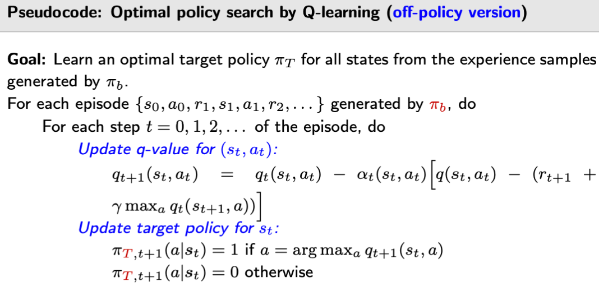

---

# Ch8.Value Function Approximation

将表格存储的 $q(s, a)$ 和 $v(s)$ 转化为函数表示，这样可以节省存储空间，只需要存放函数的参数即可。比如使用二次函数拟合
$$
\begin{align*}
\hat{v}(s, w) = as^2 + bs + c = \underbrace{[s^2, s, 1]}_{\phi^T(s)} \begin{bmatrix} a \\ b \\ c \end{bmatrix} = \phi^T(s)\underbrace{w}_{w}
\end{align*}
$$
泛化能力强，因为之前更新 $v(s)$ 只更新一个具体 $s_n$ 的值，现在更新函数的话，会导致整个周围的 $s_{n-1},\ s_{n+1}$ 等的 value 也会被更新 

设定目标函数
$$
\begin{align*}
J(w) &= \mathbb{E}[(v_\pi(S) - \hat{v}(S, w))^2] \\
&= \sum_{s \in S} d_\pi(s)(v_\pi(s) - \hat{v}(s, w))^2 \quad 
\end{align*}
$$
$d_\pi(s) \geq 0$ and $\sum_{s \in S} d_\pi(s) = 1$：使用一种策略生成很多的 experience，达到一种平稳状态（ stationary distribution ），生成一个 $s$ 的概率分布。有 $P_\pi$ 时，$d_\pi$ 迭代求解公式为 $d_\pi^T = d_\pi^T P_\pi$

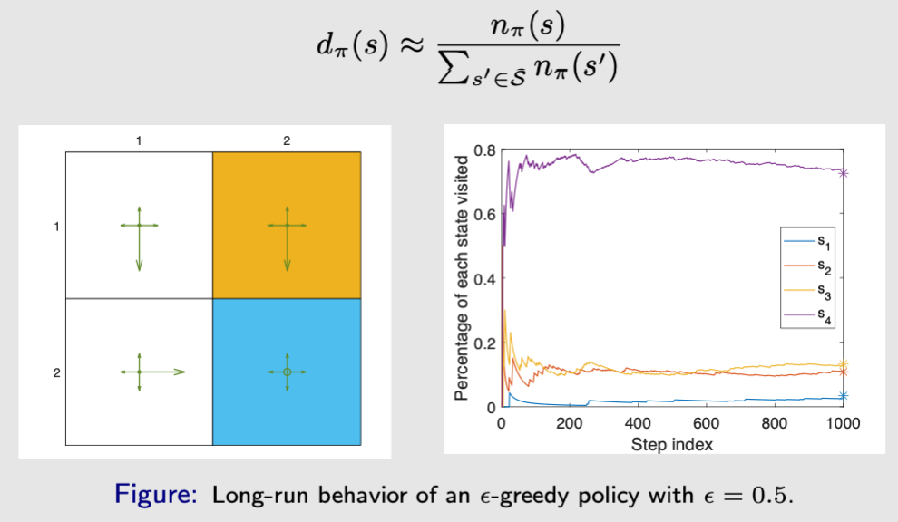

### 优化方法

$$
\begin{align*}
w_{k+1} &= w_k - \alpha_k \nabla_w J(w_k) \\
\nabla_w J(w) &= \nabla_w \mathbb{E}[(v_\pi(S) - \hat{v}(S, w))^2] \\
&= \mathbb{E}[\nabla_w (v_\pi(S) - \hat{v}(S, w))^2] \\
&= 2\mathbb{E}[(v_\pi(S) - \hat{v}(S, w))(-\nabla_w \hat{v}(S, w))] \\
&= -2\mathbb{E}[(v_\pi(S) - \hat{v}(S, w))\nabla_w \hat{v}(S, w)]
\end{align*}
$$

$$
\begin{align*}
w_{k+1} &= w_k + \alpha_k \mathbb{E}[(v_\pi(S) - \hat{v}(S, w))\nabla_w \hat{v}(S, w)] \\
&\Downarrow \\
w_{t+1} &= w_t + \alpha_t (v_\pi(s_t) - \hat{v}(s_t, w_t))\nabla_w \hat{v}(s_t, w_t) \quad 2\alpha_t \rightarrow \alpha_t
\end{align*}
$$

此算法无法实施，因为需要获取真实的 $v_\pi$，因此使用近似算法估计 $v_\pi$

- Monte Carlo：使用 $g_t$（以 $s_t$ 为起点的 episode 的 discounted return）估计 $v_\pi(s_t)$，$w_{t+1} = w_t + \alpha_t (g_t - \hat{v}(s_t, w_t))\nabla_w \hat{v}(s_t, w_t)$
- TD learning：使用 $r_{t+1} + \gamma \hat{v}(s_{t+1}, w_t)$ 估计 $v_\pi(s_t)$，$w_{t+1} = w_t + \alpha_t (r_{t+1} + \gamma \hat{v}(s_{t+1}, w_t) - \hat{v}(s_t, w_t))\nabla_w \hat{v}(s_t, w_t)$


### Sarsa with function approximation

$$
\begin{align*}
w_{t+1} = w_t + \alpha_t \left[r_{t+1} + \gamma \hat{q}(s_{t+1}, a_{t+1}, w_t) - \hat{q}(s_t, a_t, w_t)\right] \nabla_w \hat{q}(s_t, a_t, w_t)
\end{align*}
$$


### Q-learning with function approximation

$$
\begin{align*}
w_{t+1} = w_t + \alpha_t \left[r_{t+1} + \gamma \max_{a \in A(s_{t+1})} \hat{q}(s_{t+1}, a, w_t) - \hat{q}(s_t, a_t, w_t)\right] \nabla_w \hat{q}(s_t, a_t, w_t)
\end{align*}
$$


### Deep Q-learning（DQN）

##### 两个 network

- main network：$\hat{q}(s, a, w)$
- target network：$\hat{q}(s, a, w_T)$

$$
\begin{align*}
\nabla_w J = \mathbb{E}\left[\left(R + \gamma \max_{a \in A(S')} \color{red}{\hat{q}(S', a, w_T)} - \color{blue}{\hat{q}(S, A, w)}\right) \nabla_w \hat{q}(S, A, w)\right]
\end{align*}
$$

$w_T$ 一段时间内不更新，作为常量，之后用这段时间训练得到的新 $w$ 更新 $w_t$ 进行下阶段的训练

##### Experience replay

收集的 experiences 放到一起，并非按顺序送进网络，而是**均匀分布的抽取**，这样的好处是数据可以重复使用
$$
\begin{align*}
replay\ \ buffer\ \ \mathcal{B} = \{(s, a, r, s')\}
\end{align*}
$$

##### Tabular Q-learning vs DQN

- Tabular Q-learning 有模型，在计算贝尔曼最优方程，不需要 $(s,a)$ 的这种均匀分布
- DQN 没有模型，需要计算 $\mathbb{E}$，需要有 $(s,a)$ 这种均匀分布

##### Pseudocode（代码中没有显示使用上述公式，是因为现在神经网络可以自己计算梯度 backward ）


---

# Ch9.Policy Gradient Methods

### Metric

##### average value

$$
\begin{align*}
\bar{v}_\pi &= \sum_{s \in S} d(s) v_\pi(s) = d^Tv_\pi \\
&= \mathbb{E}\left[\sum_{t=0}^{\infty} \gamma^t R_{t+1}\right] \\
&= \sum_{s \in S} d(s) \mathbb{E}\left[\sum_{t=0}^{\infty} \gamma^t R_{t+1} \Big| S_0 = s\right] \\
v_\pi &= [\ldots, v_\pi(s), \ldots]^T \in \mathbb{R}^{|S|} \\
d &= [\ldots, d(s), \ldots]^T \in \mathbb{R}^{|S|}
\end{align*}
$$

选择分布 $d$

- $d$ 和 $\pi$ 独立：
  - $d_0(s) = 1 / |\mathbb{S}|$
  - $d_0(s_0) = 1, \quad d_0(s \neq s_0) = 0$，特别关注 $s_0$ 时
- $d$ 和 $\pi$ 相关：
  - $d_\pi^T P_\pi = d_\pi^T$

##### average reward

$$
\begin{align*}
\bar{r}_\pi &= \sum_{s \in S} d_\pi(s) r_\pi(s) = \mathbb{E}[r_\pi(S)], \\
r_\pi(s) &= \sum_{a \in A} \pi(a|s) r(s, a) \\
r(s, a) &= \mathbb{E}[R|s, a] = \sum_r r p(r|s, a)
\end{align*}
$$

论文常见形式
$$
\begin{align*}
&\lim_{n \to \infty} \frac{1}{n} \mathbb{E}\left[R_1 + R_2 + \cdots + R_n \Big| S_0 = s_0\right] \\
&= \lim_{n \to \infty} \frac{1}{n} \mathbb{E}\left[\sum_{t=0}^{n-1} R_{t+1} \Big| S_0 = s_0\right] \\
&= \lim_{n \to \infty} \frac{1}{n} \mathbb{E}\left[\sum_{t=0}^{n-1} R_{t+1}\right] \quad 无穷步从哪开始已经不重要\\
&= \sum_s d_\pi(s) r_\pi(s) \\
&= \bar{r}_\pi
\end{align*}
$$

##### $\bar{r}_\pi $ vs $\bar{v}_\pi$

$$
\begin{align*}
\bar{r}_\pi = (1 - \gamma)\bar{v}_\pi
\end{align*}
$$


### Gradients of the Metrics

$J(\theta)$ 可以指 $\bar{r}_\pi \ \bar{v}_\pi \ \bar{v}_\pi^0$
$$
\begin{align*}
\nabla_\theta J(\theta) &= \sum_{s \in S} \eta(s) \sum_{a \in A} \nabla_\theta \pi(a|s, \theta) q_\pi(s, a) \\
&= \sum_s \eta(s) \sum_a \pi(a|s, \theta) \nabla_\theta \ln \pi(a|s, \theta) q_\pi(s, a) \\
&= \mathbb{E}_{S \sim \eta} \left[\sum_a \pi(a|S, \theta) \nabla_\theta \ln \pi(a|S, \theta) q_\pi(S, a)\right] \\
&= \mathbb{E}_{S \sim \eta, A \sim \pi} \left[\nabla_\theta \ln \pi(A|S, \theta) q_\pi(S, A)\right] \\
&= \mathbb{E}\left[\nabla_\theta \ln \pi(A|S, \theta) q_\pi(S, A)\right] \\
&\approx \nabla_\theta \ln \pi(a|s, \theta) q_\pi(s, a)
\end{align*}
$$

$$
\begin{align*}
\pi(a|s, \theta) = \frac{e^{h(s,a,\theta)}}{\sum_{a' \in A} e^{h(s,a',\theta)}}
\end{align*}
$$

### Gradient-ascent algorithm

$$
\begin{align*}
\theta_{t+1} &= \theta_t + \alpha \nabla_\theta J(\theta_t) \\
&= \theta_t + \alpha \mathbb{E}\left[\nabla_\theta \ln \pi(A|S, \theta_t) q_\pi(S, A)\right] \\
&= \theta_t + \alpha \nabla_\theta \ln \pi(a_t|s_t, \theta_t) q_\pi(s_t, a_t) \\
&= \theta_t + \alpha \nabla_\theta \ln \pi(a_t|s_t, \theta_t) q_t(s_t, a_t)
\end{align*}
$$

- REINFORCE：使用 Monte Carlo 的长 episode 采样得到的 $q_t(s_t, a_t)$ 近似无法获得的 $q_\pi(s_t, a_t)$
- on-policy

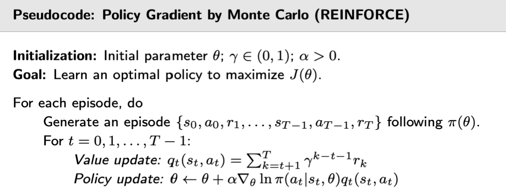

---

# Ch10.Actor-Critic Methods

### QAC

$$
\begin{align*}
\theta_{t+1} = \theta_t + \alpha \nabla_\theta \ln \pi(a_t|s_t, \theta_t) q_t(s_t, a_t) 
\end{align*}
$$

- Actor：policy update，整个式子就是在更新策略
- Critic：policy evaluation，进行策略的评估
  - REINFORCE：使用 Monte Carlo，即 $q_t(s_t, a_t)$ 近似 $q_\pi(s_t, a_t)$
  - Actor-Critic：使用 TD（ Sarsa + value function approximation ）


### A2C

$$
\begin{align*}
\nabla_\theta J(\theta) &= \mathbb{E}_{S \sim \eta, A \sim \pi} \left[\nabla_\theta \ln \pi(A|S, \theta_t) q_\pi(S, A)\right] \\
&= \mathbb{E}_{S \sim \eta, A \sim \pi} \left[\nabla_\theta \ln \pi(A|S, \theta_t) (q_\pi(S, A) - b(S))\right]
\end{align*}
$$

使用 $b(S)$ 来降低 variance
$$
\begin{align*}
b^*(s) &= \frac{\mathbb{E}_{A \sim \pi}[\|\nabla_\theta \ln \pi(A|s, \theta_t)\|^2 q_\pi(s, A)]}{\mathbb{E}_{A \sim \pi}[\|\nabla_\theta \ln \pi(A|s, \theta_t)\|^2]} \\
b(s) &= \mathbb{E}_{A \sim \pi}[q_\pi(s, A)] = v_\pi(s) \quad 一般用此简单次形态
\end{align*}
$$
使用 advantage function $\delta_\pi(S, A)$ 简化方程
$$
\begin{align*}
\theta_{t+1} &= \theta_t + \alpha \mathbb{E}\left[\nabla_\theta \ln \pi(A|S, \theta_t)[q_\pi(S, A) - v_\pi(S)]\right] \\
&= \theta_t + \alpha \mathbb{E}\left[\nabla_\theta \ln \pi(A|S, \theta_t) \delta_\pi(S, A)\right] \\
\delta_\pi(S, A) &\doteq q_\pi(S, A) - v_\pi(S)
\end{align*}
$$

$$
\begin{align*}
\theta_{t+1} &= \theta_t + \alpha \nabla_\theta \ln \pi(a_t|s_t, \theta_t) \delta_t(s_t, a_t) \\
&= \theta_t + \alpha \frac{\nabla_\theta \pi(a_t|s_t, \theta_t)}{\pi(a_t|s_t, \theta_t)} \delta_t(s_t, a_t) \\
&= \theta_t + \alpha \underbrace{\left(\frac{\delta_t(s_t, a_t)}{\pi(a_t|s_t, \theta_t)}\right)}_{\beta_t} \nabla_\theta \pi(a_t|s_t, \theta_t)
\end{align*}
$$


A2C：on-policy

### off-policy actor-critic

##### Importance sampling

给定 $x$ 的情况下可以得到 $p_0(x)$，但是得不到 $E_{X\sim p_0}(x)$，可以使用重要性采样，使用 ${x_i}\sim p_1$ 估计 $E_{X\sim p_0}(x)$
$$
\begin{align*}
\mathbb{E}_{X \sim p_0}[X] = \sum_x p_0(x) x = \sum_x p_1(x) \underbrace{\frac{p_0(x)}{p_1(x)}}_{f(x)} x &= \mathbb{E}_{X \sim p_1}[f(X)] \\
&= \frac{1}{n} \sum_{i=1}^{n}f(x_i)
\end{align*}
$$

- $\frac{p_0(x)}{p_1(x)}$：importance weight


假设 $\beta$ 是生成 experiences 的 behavior policy，目标是用这些样本更新 target policy $\pi(\theta)$ 下的  metric $J(\theta)$
$$
\begin{align*}
J(\theta) &= \sum_{s \in S} d_\beta(s) v_\pi(s) = \mathbb{E}_{S \sim d_\beta}[v_\pi(S)] \\
\nabla_\theta J(\theta) &= \mathbb{E}_{S \sim \rho, A \sim \pi}\left[\nabla_\theta \ln \pi(A|S, \theta) q_\pi(S, A)\right] \\
&= \mathbb{E}_{S \sim \rho, A \sim \beta}\left[\frac{\pi(A|S, \theta)}{\beta(A|S)} \nabla_\theta \ln \pi(A|S, \theta) q_\pi(S, A)\right] \\
&=\mathbb{E}_{S \sim \rho, A \sim \beta}\left[\frac{\pi(A|S, \theta)}{\beta(A|S)} \nabla_\theta \ln \pi(A|S, \theta) (q_\pi(S, A) - b(S))\right] \quad b(S)=v_\pi(s)
\end{align*}
$$

$$
\begin{align*}
\theta_{t+1} &= \theta_t + \alpha_\theta \frac{\pi(a_t|s_t, \theta_t)}{\beta(a_t|s_t)} \nabla_\theta \ln \pi(a_t|s_t, \theta_t) (q_t(s_t, a_t) - v_t(s_t)) \\
&= \theta_t + \alpha_\theta \frac{\pi(a_t|s_t, \theta_t)}{\beta(a_t|s_t)} \nabla_\theta \ln \pi(a_t|s_t, \theta_t) \delta_t(s_t, a_t) \\
&= \theta_t + \alpha_\theta \frac{\delta_t(s_t, a_t)}{\beta(a_t|s_t)} \nabla_\theta  \pi(a_t|s_t, \theta_t) \\
其中 \quad &q_t(s_t, a_t) - v_t(s_t) \approx r_{t+1} + \gamma v_t(s_{t+1}) - v_t(s_t) \doteq \delta_t(s_t, a_t)
\end{align*}
$$
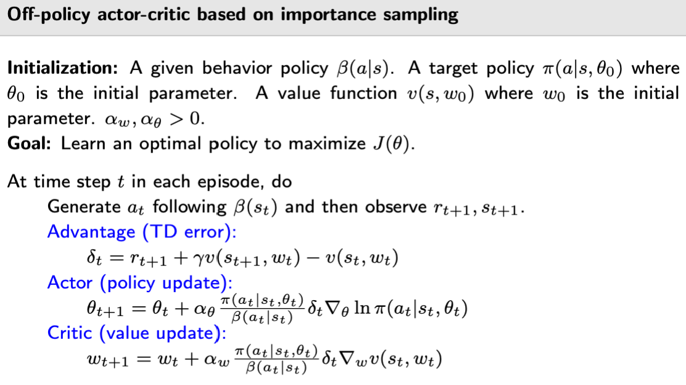

### Deterministic actor-critic（DPG）

之前的策略都是严格大于 0 且相加为 1 的，即 $\pi(a|, \theta) \in (0,1]$，仅适用于有限的 actions。DPG 适配无限策略
$$
\begin{align*}
{a = \mu(s, \theta) \doteq \mu(s)}
\end{align*}
$$

$$
\begin{align*}
\nabla_\theta J(\theta) &= \sum_{s \in \mathcal{S}} \rho_\mu(s) \nabla_\theta \mu(s) \left( \nabla_a q_\mu(s, a) \right) \Big|_{a = \mu(s)} \\
&= \mathbb{E}_{S \sim \rho_\mu} \left[ \nabla_\theta \mu(S) \left( \nabla_a q_\mu(S, a) \right) \Big|_{a = \mu(S)} \right]
\end{align*}
$$

因为最后会用 $\mu(S)$ 替换 $a$，没用使用具体的策略 $a$，因此 behavior policy 可以任选，算法是 off-policy


- DPG：$q(s, a, w) = \phi^T(s, a) w$
- Deep DPG：神经网络拟合 $q(s,a,w)$